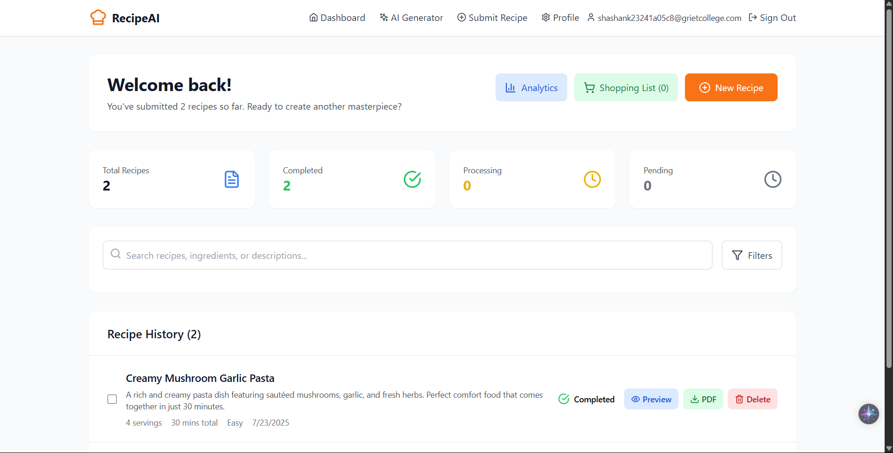

# 🍲 RecipeAI — AI-Powered Recipe Submission Platform

[🌐 Live Demo](https://silver-sherbet-4796ee.netlify.app)

RecipeAI is an intelligent and user-friendly platform that allows users to submit their own recipes, receive a professionally designed recipe card powered by AI, and have it delivered directly to their email in PDF format. The platform combines sleek UI, smart automation, and personalized experience — perfect for cooking enthusiasts, chefs, and food bloggers.

---

## 🚀 Features

- 🔐 **Secure Login/Signup** — User authentication with JWT.
- ✍️ **Recipe Submission Form** — Submit custom recipes with ingredients, instructions, and images.
- 🤖 **AI-Generated Recipe Cards** — Beautiful recipe cards auto-generated by AI.
- 📩 **PDF Email Delivery** — Submitted recipes delivered via email in PDF format.
- 📊 **User Dashboard** — Track submitted recipes and view history.
- 🔔 **Team Notifications** — Submissions notify admin via automation (e.g., using `n8n`).

---

## 🛠 Tech Stack

### Frontend
- **React 18**
- **Tailwind CSS** for modern UI
- **Vite** for fast bundling
- **Framer Motion** for animations
- **Axios** for API communication

### Backend & Automation (If integrated)
- **Node.js + Express** for APIs
- **MongoDB** for data storage
- **n8n** for automation workflows
- **SendGrid / Nodemailer** for email service
- **Cloudinary / Firebase** for image handling

---

## 📦 Local Development

```bash
# 1. Clone the repo
git clone https://github.com/your-username/recipeai.git
cd recipeai

# 2. Install dependencies
npm install

# 3. Create a .env file and add the following
VITE_API_URL=http://localhost:5000/api
VITE_N8N_WEBHOOK_URL=https://your-n8n-instance.com/webhook/recipe
VITE_JWT_SECRET=your_jwt_secret

# 4. Start the dev server
npm run dev
```

---

## 📁 Project Structure

```
src/
├── components/
│   └── SubmitRecipe.jsx
├── pages/
│   ├── Login.jsx
│   ├── Register.jsx
│   ├── Dashboard.jsx
├── services/
│   └── api.js
├── App.jsx
└── main.jsx
```

---

## 📸 Screenshots

> _You can add screenshots or screen recordings here to showcase the UI._
> 
> 
> 
> 
> 
> 


---

## 💡 Upcoming Features

- 🧑‍🍳 AI Recipe Generation from ingredients
- 📥 Save recipes offline
- 🌐 Multilingual support
- 🖼️ Image analysis for ingredient detection (CV)

---

## 🙋‍♂️ Author

**Sai Shashank**  
📧 saishashank1006@gmail.com  
🧠 [Portfolio]() | 🐙 [GitHub]() | 💼 [LinkedIn]()

---

## 📄 License

Licensed under the [MIT License](LICENSE).

---

## ❤️ Acknowledgements

- [OpenAI](https://openai.com/) — For powering AI logic
- [n8n](https://n8n.io/) — For workflow automation
- [Tailwind CSS](https://tailwindcss.com/) — For styling
- [Framer Motion](https://www.framer.com/motion/) — For animations
- [Netlify](https://www.netlify.com/) — For deployment

---

> 🔗 _Made with love by Shashank, built for modern recipe lovers and creators._